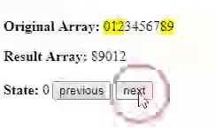

# Infinite Array Navigator



Infinite Array Navigator is a functional circular array implementation which let you navigate through arrays endlessly, focusing on one or more elements of a ordinary array.

# Installation
```
npm i infinite-array-navigator
```

# Example (using React)
You can check it working [here](https://codesandbox.io/s/kw24x9zzzv).

```javascript
import ReactDOM from "react-dom";
import React, { Component } from "react";
import InfiniteArrayNavigator, { normalizeIndex} from "infinite-array-navigator";

const array = [0, 1, 2, 3, 4, 5, 6, 7, 8, 9];

class Demo extends Component {
  constructor(props) {
    super(props);
    this.state = {
    selected: 0
    };
  }
  selectNext = () => {
    this.setState({
    selected: normalizeIndex(this.state.selected - 1, array)
    });
  };
  selectPrevious = () => {
    this.setState({
    selected: normalizeIndex(this.state.selected + 1, array)
    });
  };
  render() {
    return (
      <div>
        <h1>Infinite Array Navigator</h1>
        <p><b>Original Array: </b>{array}</p>
        <p><button onClick={this.selectNext}>previous</button></p>
        <p><b>Result Array: </b>{InfiniteArrayNavigator(array, this.state.selected, 2)}</p>
        <p><button onClick={this.selectPrevious}>next</button></p>
      </div>
    );
  }
}

ReactDOM.render(<Demo />, document.getElementById("root"));
```

# To do
- Tests coverage
